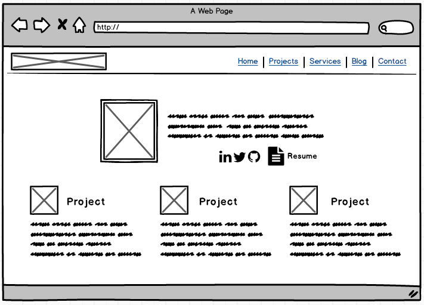
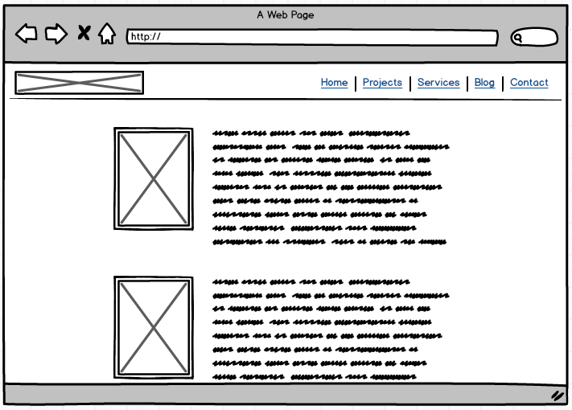

* What is a wireframe?
* Ans: A wireframe is a rough visualization that's meant to show the general layout and workflows of an application. If something is not clear at the wireframe stage, then it won't be clear in the development phase either.
* What are the benefits of wireframing?
* Ans: Wireframes are a "cheap" way in terms of time and money to design an application before starting development. This allows you to put something in front of the customer/stakeholder and iterate before the "expensive" stage of development.
* Did you enjoy wireframing your site?
* Ans: No, I don't feel like I have the eye for this aspect of web development. I'm really good at creating process and  workflows, but designing the look and feel is something I struggle with.
* Did you revise your wireframe or stick with your first idea?
* Ans: I revised it once. I could have spent a lot of time on this, but had to force myself to stop at a certain point.
* What questions did you ask during this challenge? What resources did you find to help you answer them?
* Ans: I've done this kind of work before, so the process and tools were not unfamiliar to me. I really like working with Balsamiq for wireframes, but a good free option is a Google Drive add-in called Lucidchart.
* Which parts of the challenge did you enjoy and which parts did you find tedious?
* Ans: I enjoyed thinking about the requirements and the workflows, but found myself hitting a mental block when it came time to put something down on paper. I would really enjoy representing the requirements and workflow with a designer representing the best way to display it.