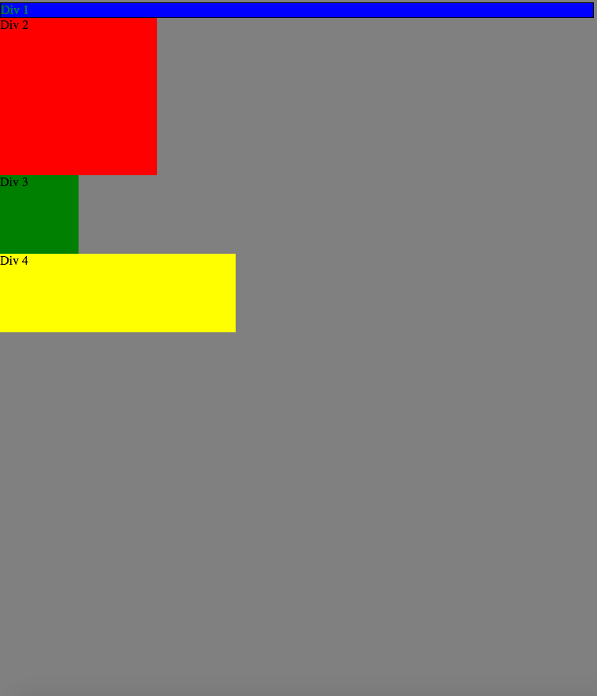
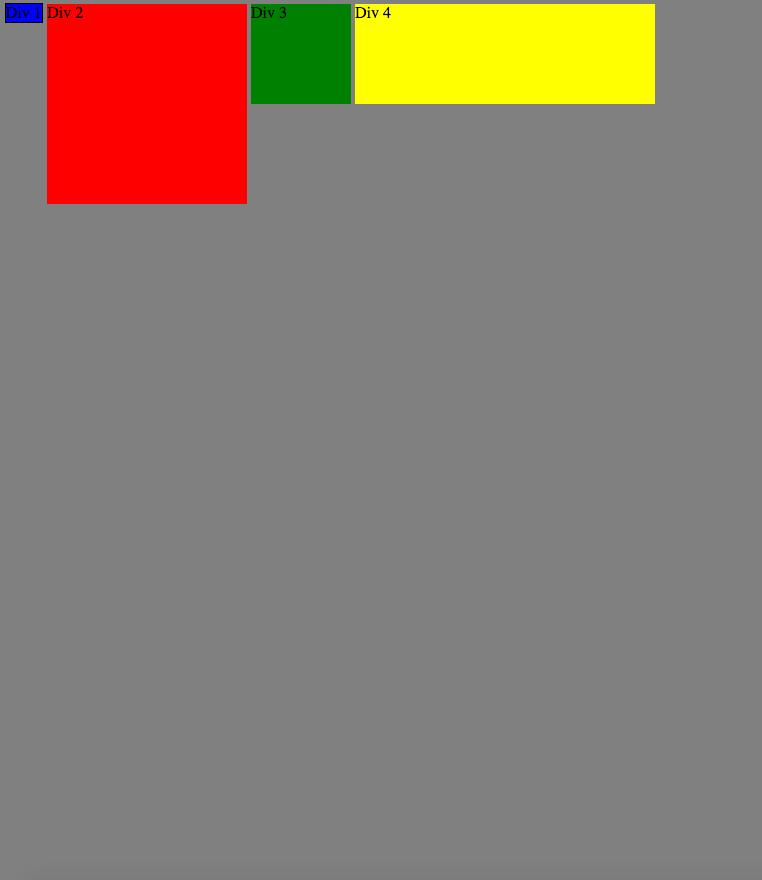
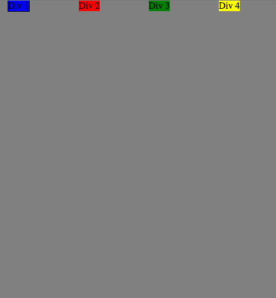
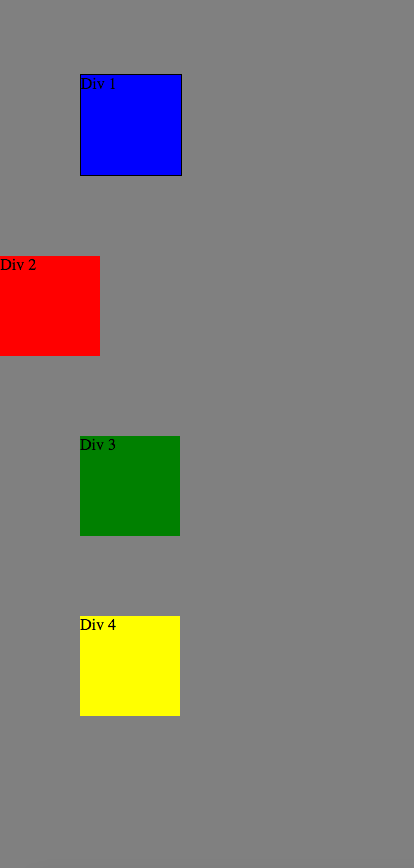
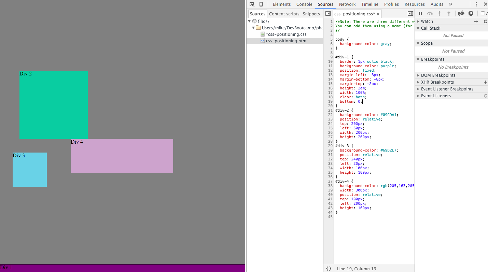
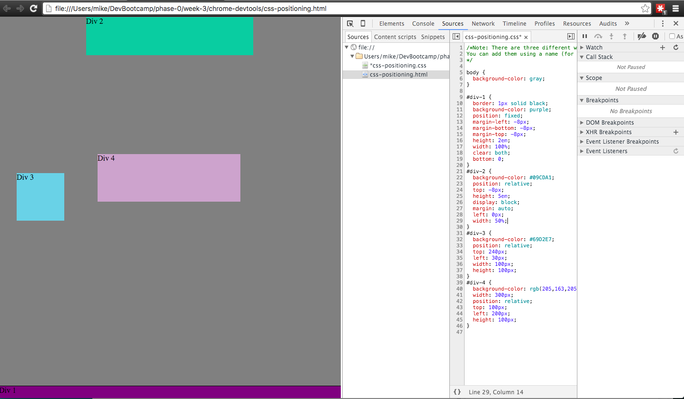
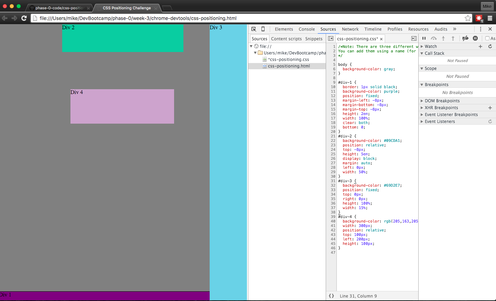
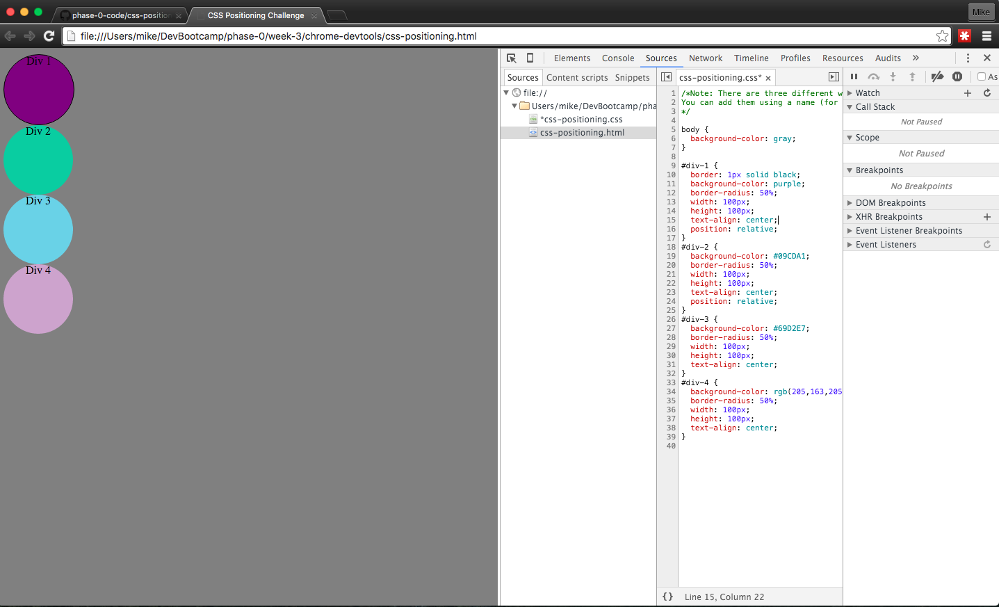

# Screenshots of Steps 1 - 9

# How can you use Chrome's DevTools inspector to help you format or position elements?
*Ans:* You can use DevTools to open up a page and make changes to the CSS on the fly. This allows you to see the effect of your changes instantly instead of going through Git, GitHub, and Publishing. You can also use built in tools to simulate other browsers or mobile devices. 
# How can you resize elements on the DOM using CSS?
*Ans:* You can resize elements based on the number of pixels in px, em's for the size of an "M", or %'s in relation to the the containting element.
# What are the differences between absolute, fixed, static, and relative positioning? Which did you find easiest to use? Which was most difficult?
*Ans:* I had to look most of these up as I'm still not 100% clear on the meaning of each and how they compare/contrast to one another. Absolute elements stay in the same place in relation to the containing element. Fixed elements stay in the same place in relation to the screen you are viewing it on. Static elements stay in the same place regardless of screen scrolling or other elements. Relative elements are positioned based on where the element would normally be without styling. I found relative to be the easiest to use and will probably use this one going forward to allow for multiple screen sizes. I found absolute elements the hardest to work with because of their interaction with other containing elements.
# What are the differences between margin, border, and padding?
*Ans:* If you imagine each element having a box around it, margin is the amount of space immediately outside the box, border is the perimiter of the box, and padding is the amount of space between the perimiter of the box and the content inside.
# What was your impression of this challenge overall? (love, hate, and why?)
*Ans:* I really did not like this challenge. If I were to do it all over again I would probably remove all of the existing CSS for the div's and start from scratch. That's probably not a great approach in the real world though because a lot of the CSS work may already be done and you might have to just figure out how to make a small change without affecting the rest of the page. I need to work with these properties/values more to fully understand them.