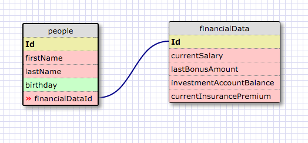
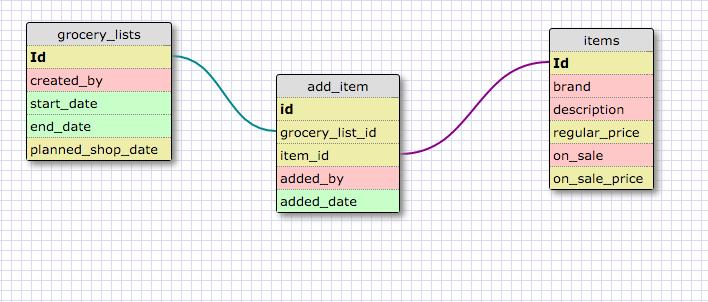

Release 2 - Create a One-to-one Schema
======================================

*Explain why this relationship is a one-to-one to the best of your ability.*
ANS: This is one-to-one because the financial data about a person is unique only to that person. Even if their financial data was similar at a point in time, the timing of changes to the data would most likely be different which means two people could not share one record.

Release 4 - Refactor
====================

Release 6 - Reflect
===================

*What is a one-to-one database?*
ANS: A one-to-one database is a database where one entity can be related to one and only one other entity.

*When would you use a one-to-one database? (Think generally, not in terms of the example you created).*
ANS: It might be important to keep data in a one-to-one relationship to limit access to it. When it is combined in one table it might be difficult to grant someone access to only certain attributes and not others. Using separate tables could also make it easier to store sensitive data at only certain physical locations. Personal, medical, financial, legal, proprietary, or security reasons come to mind for this type of use

*What is a many-to-many database?*
ANS: A many to many database is a database where many entities are related to many other entities.

*When would you use a many-to-many database? (Think generally, not in terms of the example you created).*
ANS: This is probably the most common situation we will encounter. I would use this for modeling people's relationships to the things they own, the places they visit, the applications they use, etc. Even when you think of something that might be a one to one or a one to many relationship there are always edge cases that seem to present themselves that require a many to many relationship.

*What is confusing about database schemas? What makes sense?*
ANS: Primary and foreign keys are still a bit confusing. I get the concepts of keys, but I don't always understand the diagrams right away. I get the feeling people who are good at modeling DB's just assume almost everything is possible and design them as such. After modeling a few things, it's a bit unnerving thinking about what the databases at a company like Facebook or Google might contain!

